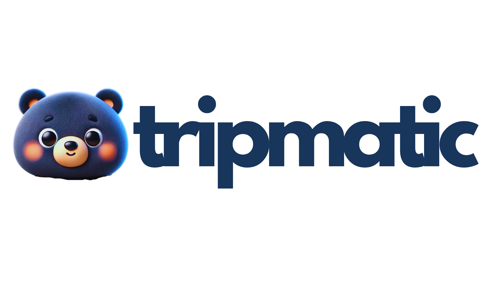

# Tripmatic App


This is a capstone project developed by UST Students for seamless travel planning.
It offers a one-stop solution for creating detailed itineraries, exploring user-shared guides, and managing bookings efficiently.

## Features

* **Itinerary Creation:** Craft personalized itineraries with ease, including destinations, activities, transportation, and accommodation.
* **User-Shared Guides:** Discover valuable travel tips and recommendations shared by other users, enriching your travel experience.
* **Booking Management:** Effortlessly keep track of all your bookings (flights, hotels, tours, etc.) in one central location.

## Technology Stack

* **Frontend:** React.js
* **Backend:** Node.js
* **Database:** MySQL (using PHP for interaction)

## Installation and Usage

**Prerequisites:**

* Node.js and npm (or yarn) installed on your system
* A MySQL database server running

**Instructions:**

Option 1. Download localy in your computer:

   ```bash
   1. Click "<> Code" 
   2. See "Local"
   3. Download Zip: file name "Tripmati-main.zip"
   ```

Option 2. Clone this repository:

   ```bash
   git clone [https://github.com/](https://github.com/)citrixlab/tripmatic.git
   ```

